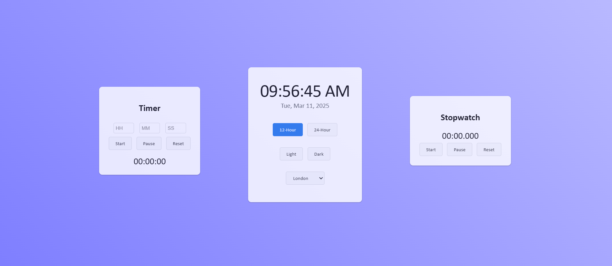

# Digital Clock with Timer & Stopwatch

An interactive **digital clock** with a **built-in timer and stopwatch**. Built using **HTML, CSS, and JavaScript**, this project provides a clean and modern interface with theme customization, a 12-hour/24-hour format toggle, and timezone selection.

## 🖼️ Preview
  

## 🚀 Features
- **Real-Time Digital Clock** – Displays the current time and date.
- **12-Hour & 24-Hour Format Toggle** – Switch between formats easily.
- **Theme Customization** – Light and Dark mode options.
- **Timer Functionality** – Set a countdown timer with hours, minutes, and seconds.
- **Stopwatch** – Tracks time with millisecond precision.
- **Timezone Selection** – Choose from multiple time zones.
- **Local Storage** – Saves preferences for theme, time format, and timezone.
- **Responsive Design** – Works seamlessly on all devices.

## 📜 Instructions
- The **clock** updates automatically with the selected **timezone**.
- Toggle between **12-hour and 24-hour formats** using the provided buttons.
- Switch between **light and dark themes** for a better visual experience.
- Use the **timer** by entering the hours, minutes, and seconds, then press **Start**.
- The **stopwatch** allows you to **start, pause, and reset** the timer with precision.
- Preferences are **saved automatically** in local storage.

## 🛠️ Technologies Used
- **HTML** – Structure of the web page.
- **CSS** – Styling and theme customization.
- **JavaScript** – Functionality for clock, timer, and stopwatch.
